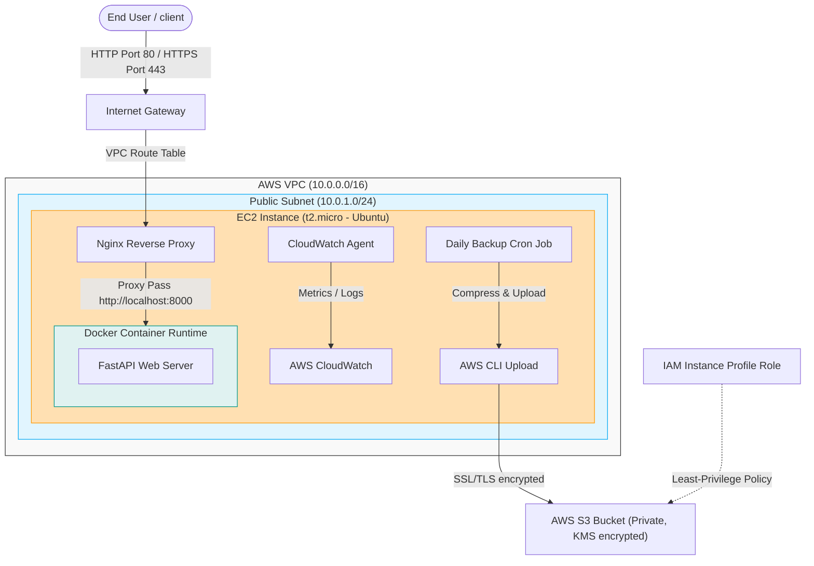
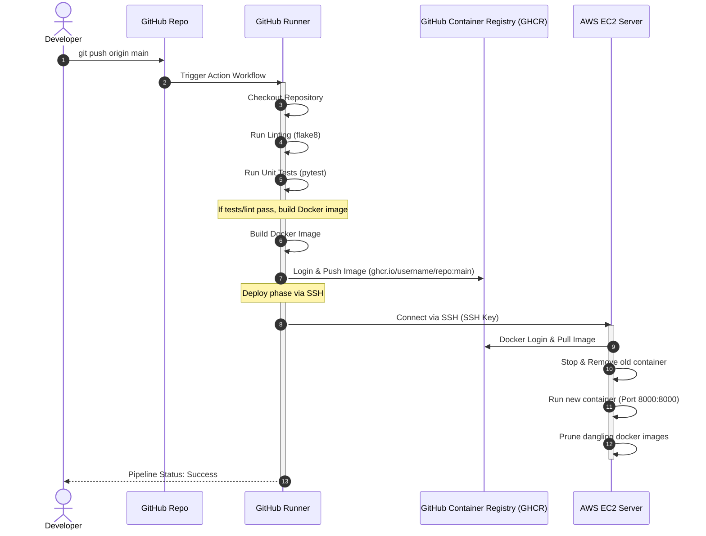

# Architecture Reference & Data Flow

This document details the system design, network infrastructure, and delivery pipeline for the DevOps Technical Assignment.

## System Architecture

The infrastructure runs within the AWS Free Tier, leveraging custom VPC configurations and least-privilege access rules to host the containerized API.

### Components Summary

1. **Virtual Private Cloud (VPC)**: Custom IP range (`10.0.0.0/16`) isolating all subnets from the default VPC network.
2. **Public Subnet**: Holds the EC2 instance, provisioned with an Elastic IP/Public IP, routing out through the Internet Gateway (IGW).
3. **Nginx Reverse Proxy**: Receives connection requests on port 80/443, handles SSL termination, and routes traffic back to the local FastAPI port (`8000`).
4. **FastAPI Docker Container**: The Python application packaged and run inside Docker, securing separation from the host system dependencies.
5. **AWS S3 Backup Bucket**: Log and database snapshot storage. Configured with Versioning, Encryption (SSE-AES256), and Public Access Block.
6. **IAM Role**: Role attached to the EC2 instance providing temporary credentials for write access to the S3 bucket.
7. **CloudWatch Monitoring**: Receives performance counters (CPU, RAM usage) and standard service error logs to trigger alarms.

---

## CI/CD Pipeline Workflow

The repository uses GitHub Actions to automate testing, compilation, and deployment on every git push to the main branch.

